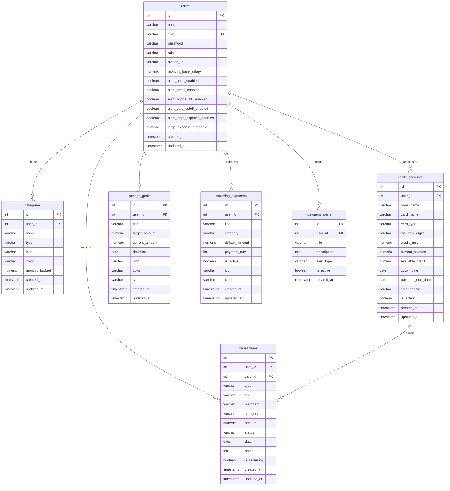

# 💼 Control de Gastos — Enterprise Financial & Expense Management System

<p align="center">
  <strong>Plataforma integral empresarial de gestión financiera, control de flujos de caja, presupuestos, egresos, ingresos y analítica de tendencias en tiempo real con interfaz Glassmorphism 4K.</strong>
</p>

<p align="center">
  
  
  
  
  
  
</p>

---

## 📌 Tabla de Contenidos

1. [Descripción General](#-descripción-general)
2. [Arquitectura del Sistema](#-arquitectura-del-sistema)
3. [Módulos y Capacidades](#-módulos-y-capacidades)
4. [Esquema de Base de Datos (PostgreSQL)](#-esquema-de-base-de-datos-postgresql)
5. [Endpoints de la API REST](#-endpoints-de-la-api-rest)
6. [Documentación y Mapeo de Módulos (Propuestas Glassmorphism .docx)](#-documentación-y-mapeo-de-módulos-propuestas-glassmorphism-docx)
7. [Estructura del Repositorio](#-estructura-del-repositorio)
8. [Guía de Instalación y Puesta en Marcha](#-guía-de-instalación-y-puesta-en-marcha)
9. [Credenciales por Defecto (Auto-Seeding)](#-credenciales-por-defecto-auto-seeding)
10. [Seguridad y Mejores Prácticas](#-seguridad-y-mejores-prácticas)
11. [Créditos e Información Académica](#-créditos-e-información-académica)

---

## 📖 Descripción General

**Control de Gastos** es una solución web full-stack de grado empresarial diseñada para el control exhaustivo de finanzas personales y corporativas. Implementada bajo principios de **Clean Architecture** y estricta separación de capas de dominio, infraestructura y presentación, la plataforma ofrece una experiencia inmersiva mediante una interfaz de usuario basada en **Glassmorphism 4K** (desenfoque de fondo dinámico, efectos neón, bordes translúcidos y contrastes adaptativos).

Incorpora además adaptaciones normativas financieras y laborales regionales (específicamente la legislación de la República de Guatemala: **Bono 14 - Decreto 42-92** y **Aguinaldo - Decreto 76-78**), así como motor de proyecciones y exportación directa de estados financieros a PDF de alta resolución.

### ✨ Aspectos Clave
- **Autenticación Robusta & Rate Limiting**: Cifrado con Bcrypt (10 rondas), JSON Web Tokens (JWT) con expiración configurable y protección contra ataques de fuerza bruta vía `express-rate-limit`.
- **Persistencia Transaccional PostgreSQL**: Arquitectura con `pg.Pool`, transacciones ACID seguras (`BEGIN`, `COMMIT`, `ROLLBACK`) y scripts automatizados de migración y siembra de datos.
- **Frontend Reactivo con Angular Signals**: Manejo del estado centralizado y reactivo mediante Standalone Components e interceptores HTTP nativos.
- **Visualización Analítica Matemática**: Gráficos SVG interactivos calculados matemáticamente (donas porcentuales, curvas de spline cúbico de tendencias con resplandor neón).
- **Control Presupuestario en Tiempo Real**: Cálculo automático de umbrales preventivos al 80% y 100% de ejecución presupuestaria.
- **Motor Salarial y Prestaciones de Ley**: Estimación algorítmica de pasivos laborales anuales basados en salario nominal.
- **Respaldos de Información en Caliente**: Exportación de base de datos a JSON y módulo de restauración integral en caliente.

---

## 🏛 Arquitectura del Sistema

```text
┌─────────────────────────────────────────────────────────────────────────────┐
│                          CAPA DE PRESENTACIÓN (FRONTEND)                    │
│  - Angular 19 (Standalone Components, Signals, Reactive Forms, Router)       │
│  - Estética Glassmorphism 4K (Backdrop-filter blur, CSS Custom Properties)  │
│  - Motor de Gráficos SVG Paramétricos (Spline Cúbico, Donut Multi-segmento)  │
│  - Generación de Informes PDF (jsPDF + AutoTable)                           │
│  - Interceptores HTTP (JWT Injection, Error Handling & Session Storage)     │
└──────────────────────────────────────┬──────────────────────────────────────┘
                                       │ HTTP / JSON (REST API Bearer Token)
                                       ▼
┌─────────────────────────────────────────────────────────────────────────────┐
│                            CAPA DE APLICACIÓN (BACKEND)                     │
│  - Node.js 20.x & Express 4.x (TypeScript 5.x / ESM)                        │
│  - Seguridad Perimetral (Helmet, CORS Strict Whitelisting, Rate Limiter)    │
│  - Middlewares de Autenticación (JWT Verify) y Autorización RBAC            │
│  - Módulos de Dominio: Auth, Users, Dashboard, Tarjetas, Metas, Reportes    │
│  - Controladores REST, Servicios de Negocio y Repositorios SQL Parametrizados│
└──────────────────────────────────────┬──────────────────────────────────────┘
                                       │ Driver Nativo pg Pool (Pool de Conexiones)
                                       ▼
┌─────────────────────────────────────────────────────────────────────────────┐
│                        CAPA DE PERSISTENCIA (POSTGRESQL 15+)                │
│  - users (Perfiles, Seguridad, Configuración Salarial y Alertas)            │
│  - categories (Catálogo jerárquico de ingresos/egresos y presupuestos)      │
│  - cards_accounts (Instrumentos de crédito, débitos y fechas de corte)      │
│  - transactions (Historial transaccional con estados ACID y metadatos)      │
│  - savings_goals (Metas financieras con seguimiento de aportes/retiros)     │
│  - recurring_expenses (Egresos fijos automatizables por periodo)            │
│  - payment_alerts (Notificaciones reactivas de umbrales y cortes)          │
└─────────────────────────────────────────────────────────────────────────────┘
```

---

## 🚀 Módulos y Capacidades

### 1. 🔐 Autenticación, Seguridad y Perfiles (RBAC)
- Inicio de sesión seguro con correo y contraseña cifrada con `bcryptjs`.
- Protección perimetral contra fuerza bruta (10 intentos / 15 min en `/api/auth/login`).
- Integración opcional de autenticación federada con **Google Identity Services**.
- Guardias de enrutamiento Angular (`authGuard`, `roleGuard`) que impiden acceso no autorizado.
- Gestión de roles de usuario (`ADMIN` y `USER`) con panel administrativo para cambio dinámico de permisos.

### 2. 📊 Dashboard Ejecutivo Financiero
- **KPIs en Tiempo Real**: Balance Neto Disponible, Ingresos Totales Acumulados, Egresos Totales y Porcentaje de Cumplimiento de Ahorro.
- **Gráfico de Donut SVG Interactivo**: Desglose porcentual de gastos por categorías con tooltips enriquecidos.
- **Alertas Financieras Activas**: Identificación visual de desviaciones presupuestarias superiores al 80% y proximidad de fechas de corte en tarjetas.
- **Historial Transaccional Reciente**: Listado con badges de estado (`COMPLETED`, `PENDING`, `CANCELLED`).

### 3. 📉 Módulo de Control de Egresos (Gastos)
- **Registro Detallado**: Captura de fecha, monto, establecimiento comercial (*merchant*), categoría, medio de pago y notas complementarias.
- **Filtros Avanzados**: Búsqueda por palabra clave, filtrado por rangos de fechas y categorización dinámica.
- **Acciones Rápidas CRUD**: Creación reactiva, edición modal y eliminación segura con actualización inmediata de saldos.

### 4. 📈 Módulo de Control de Ingresos
- **Monitoreo de Flujos Positivos**: Registro y conciliación de salarios, dividendos, honorarios y retornos de inversión.
- **Curva de Tendencia Spline Cúbica SVG**: Gráfico interactivo con degradados esmeralda neón y alternancia de periodos de visualización.
- **Estadísticas Comparativas**: Medición de crecimiento porcentual mensual.

### 5. 🎯 Módulo de Presupuestos y Metas de Ahorro
- **Definición de Techos Presupuestarios**: Asignación de presupuestos mensuales máximos por categoría de gasto.
- **Barras de Progreso Dinámicas**: Colores reactivos según criticidad (Verde < 70%, Amarillo 70%-89%, Rojo >= 90%).
- **Huchas y Metas de Ahorro**: Creación de objetivos con fecha límite, cálculo de progreso y funciones directas para abonar fondos (*contribute*) o retirar fondos (*withdraw*).

### 6. 🏷️ Gestión de Categorías Personalizadas
- **Catálogo Flexible**: Creación de categorías para transacciones de tipo `INCOME` y `EXPENSE`.
- **Identidad Visual**: Asignación de iconos dinámicos y paletas cromáticas hexadecimales personalizables.
- **Aislamiento Multi-Tenant**: Cada usuario mantiene sus propias categorías personalizadas además de las predefinidas del sistema.

### 7. 💳 Gestión de Tarjetas y Cuentas Bancarias
- **Control de Líneas de Crédito**: Seguimiento de límite asignado, saldo utilizado y crédito disponible.
- **Monitoreo de Fechas Críticas**: Alertas automáticas para Fecha de Corte y Fecha Límite de Pago para evitar mora e intereses.
- **Soporte Multi-Entidad**: Registro de tarjetas Visa, Mastercard, AMEX y cuentas monetarias/ahorro.

### 8. 🔄 Gastos Fijos y Recurrentes
- **Planificación de Servicios Esenciales**: Registro de cobros fijos mensuales (Alquiler, Servicios Básicos, Suscripciones, Conectividad).
- **Disparo en Lote (*Apply Month*)**: Posibilidad de aplicar automáticamente los gastos recurrentes del periodo a las transacciones reales en un solo clic.

### 9. 📑 Informes, Analítica y Exportación (PDF / Tabular)
- **Resumen Financiero Ejecutivo**: Comparativa de ingresos vs. egresos con balance final.
- **Matriz de Distribución de Egresos**: Tablas consolidadas con recuento de operaciones, montos totales y peso porcentual sobre el gasto global.
- **Exportación a PDF Corporativo**: Generación mediante `jsPDF` y `jspdf-autotable` con diseño formal, encabezados vectoriales y tablas formateadas con moneda local (GTQ / USD).

### 10. ⚙️ Configuración, Legislación Laboral y Respaldos
- **Perfil Salarial de Guatemala**: Cálculo automatizado de prestaciones según el Código de Trabajo de Guatemala:
  - **Bono 14 (Decreto 42-92)**: Equivalente a un salario mensual base devengado en julio.
  - **Aguinaldo (Decreto 76-78)**: Equivalente a un salario mensual base devengado en diciembre.
- **Centro de Notificaciones y Preferencias**: Control de alertas push/email y ajuste de umbral de alerta para gastos mayores.
- **Backup & Restore**: Exportación completa de datos en formato JSON portable y mecanismo de restauración transaccional.

---

## 🗄 Esquema de Base de Datos (PostgreSQL)



---

## 📡 Endpoints de la API REST

Todas las rutas protegidas requieren la cabecera HTTP: `Authorization: Bearer <token_jwt>`.

### 🔑 Autenticación (`/api/auth`)
| Método | Endpoint | Descripción | Acceso | Body / Parámetros |
|---|---|---|---|---|
| `POST` | `/api/auth/register` | Registro de nuevo usuario en la plataforma | Público (Rate limited) | `{ name, email, password }` |
| `POST` | `/api/auth/login` | Inicio de sesión, validación de hash y entrega de JWT | Público (Rate limited) | `{ email, password }` |
| `POST` | `/api/auth/google` | Autenticación federada mediante Google Identity | Público (Rate limited) | `{ idToken }` |
| `GET` | `/api/auth/me` | Obtiene el perfil y claims del usuario en sesión | Autenticado | — |

### 👥 Administración de Usuarios (`/api/users` & `/api/admin`)
| Método | Endpoint | Descripción | Acceso | Body / Parámetros |
|---|---|---|---|---|
| `GET` | `/api/users` | Listado consolidado de usuarios registrados | Solo `ADMIN` | — |
| `PATCH` | `/api/users/:id/role` | Modificación del rol de acceso (`ADMIN` / `USER`) | Solo `ADMIN` | `{ role: 'ADMIN' \| 'USER' }` |
| `GET` | `/api/admin/test` | Endpoint de verificación de privilegios de administrador | Solo `ADMIN` | — |

### 📊 Dashboard, Transacciones y Operaciones Financieras (`/api/dashboard`)
| Método | Endpoint | Descripción | Acceso | Body / Parámetros |
|---|---|---|---|---|
| `GET` | `/api/dashboard/stats` | Estadísticas consolidadas, KPIs, balances y alertas | Autenticado | — |
| `POST` | `/api/dashboard/incomes` | Registra una nueva entrada o ingreso de capital | Autenticado | `{ title, amount, category, date, notes? }` |
| `POST` | `/api/dashboard/expenses` | Registra un nuevo egreso vinculado opcionalmente a tarjeta | Autenticado | `{ title, merchant?, amount, category, date, cardId?, notes? }` |
| `PATCH` / `PUT` | `/api/dashboard/transactions/:id` | Modificación integral o parcial de una transacción | Autenticado | `{ title?, amount?, category?, date?, merchant?, notes? }` |
| `DELETE` | `/api/dashboard/transactions/:id` | Eliminación física definitiva de una transacción | Autenticado | Parámetro `id` en la URL |
| `PATCH` | `/api/dashboard/savings-goal` | Actualiza la meta de ahorro principal del mes | Autenticado | `{ targetAmount, currentAmount? }` |
| `PATCH` | `/api/dashboard/alerts/:id/dismiss` | Desactiva o descarta una alerta de pago activa | Autenticado | Parámetro `id` en la URL |

### 💳 Instrumentos Financieros y Tarjetas (`/api/dashboard`)
| Método | Endpoint | Descripción | Acceso | Body / Parámetros |
|---|---|---|---|---|
| `GET` | `/api/dashboard/cards` | Consulta de tarjetas y cuentas del usuario autenticado | Autenticado | — |
| `POST` | `/api/dashboard/cards` | Registra una nueva tarjeta de crédito o cuenta bancaria | Autenticado | `{ bankName, cardName, cardType, lastFourDigits, creditLimit, cutoffDate, paymentDueDate, colorTheme }` |
| `POST` | `/api/dashboard/credit-payments` | Registra el abono/pago hacia una tarjeta de crédito | Autenticado | `{ cardId, amount, date, notes? }` |
| `DELETE` | `/api/dashboard/cards/:id` | Remueve un instrumento financiero del perfil | Autenticado | Parámetro `id` en la URL |

### 🎯 Metas de Ahorro Específicas (`/api/dashboard`)
| Método | Endpoint | Descripción | Acceso | Body / Parámetros |
|---|---|---|---|---|
| `GET` | `/api/dashboard/savings-goals` | Lista todas las metas de ahorro configuradas | Autenticado | — |
| `POST` | `/api/dashboard/savings-goals` | Crea una nueva meta de ahorro con fecha y monto objetivo | Autenticado | `{ title, targetAmount, deadline?, icon?, color? }` |
| `POST` | `/api/dashboard/savings-goals/:id/contribute` | Añade fondos a una meta de ahorro específica | Autenticado | `{ amount }` |
| `POST` | `/api/dashboard/savings-goals/:id/withdraw` | Retira fondos acumulados de una meta de ahorro | Autenticado | `{ amount }` |
| `DELETE` | `/api/dashboard/savings-goals/:id` | Elimina una meta de ahorro | Autenticado | Parámetro `id` en la URL |

### 🔄 Gastos Recurrentes (`/api/dashboard`)
| Método | Endpoint | Descripción | Acceso | Body / Parámetros |
|---|---|---|---|---|
| `GET` | `/api/dashboard/recurring-expenses` | Obtiene el catálogo de gastos periódicos fijos | Autenticado | — |
| `POST` | `/api/dashboard/recurring-expenses` | Registra un nuevo compromiso de gasto recurrente | Autenticado | `{ title, category, defaultAmount, paymentDay, icon?, color? }` |
| `POST` | `/api/dashboard/recurring-expenses/apply-month` | Impacta y genera transacciones del lote de gastos del mes | Autenticado | `{ monthYear? }` |
| `DELETE` | `/api/dashboard/recurring-expenses/:id` | Elimina un gasto recurrente programado | Autenticado | Parámetro `id` en la URL |

### 🏷️ Categorías Personalizadas (`/api/dashboard`)
| Método | Endpoint | Descripción | Acceso | Body / Parámetros |
|---|---|---|---|---|
| `GET` | `/api/dashboard/categories` | Lista de categorías disponibles (globales + usuario) | Autenticado | — |
| `POST` | `/api/dashboard/categories` | Crea una categoría personalizada con presupuesto | Autenticado | `{ name, type, icon, color, monthlyBudget }` |
| `PUT` | `/api/dashboard/categories/:id` | Actualiza nombre, icono, color o presupuesto mensual | Autenticado | `{ name, type, icon, color, monthlyBudget }` |
| `DELETE` | `/api/dashboard/categories/:id` | Elimina una categoría personalizada del usuario | Autenticado | Parámetro `id` en la URL |

### ⚙️ Perfil Salarial, Preferencias y Respaldos (`/api/dashboard`)
| Método | Endpoint | Descripción | Acceso | Body / Parámetros |
|---|---|---|---|---|
| `GET` | `/api/dashboard/salary-profile` | Retorna salario base y cálculo de Bono 14 y Aguinaldo | Autenticado | — |
| `PUT` | `/api/dashboard/salary-profile` | Actualiza el salario base mensual devengado | Autenticado | `{ monthlyBaseSalary }` |
| `GET` | `/api/dashboard/preferences` | Obtiene la configuración de alertas y notificaciones | Autenticado | — |
| `PUT` | `/api/dashboard/preferences` | Modifica umbrales y canales activos de notificación | Autenticado | `{ alertPushEnabled, alertEmailEnabled, alertBudget80Enabled, alertCardCutoffEnabled, alertLargeExpenseEnabled, largeExpenseThreshold }` |
| `GET` | `/api/dashboard/backup` | Genera un dump completo en formato JSON de los datos | Autenticado | — |
| `POST` | `/api/dashboard/restore` | Restaura de forma transaccional una copia de respaldo JSON | Autenticado | `{ data: BackupPayload }` |

---

## 📑 Documentación y Mapeo de Módulos (Propuestas Glassmorphism .docx)

El repositorio incluye la colección completa de propuestas de arquitectura de interfaz, diagramación y mapeo funcional en documentos formales `.docx`, redactados bajo estándares de diseño Glassmorphism 4K:

| Módulo | Documento Oficial | Descripción y Alcance | Enlace Directo (GitHub) |
|---|---|---|---|
| **Presupuestos** | `Propuesta_Mapeo_Presupuestos_Glassmorphism.docx` | Documentación integral del módulo de presupuestos: barras reactivas de ejecución, alertas preventivas del 80% y 100%, metas de ahorro (*savings goals*) y flujos de conciliación. | [Ver Documento](https://github.com/agarcia-2022075/control-gastos-v3/blob/agarcia-2022075/Propuesta_Mapeo_Presupuestos_Glassmorphism.docx) · [Descargar](https://github.com/agarcia-2022075/control-gastos-v3/raw/agarcia-2022075/Propuesta_Mapeo_Presupuestos_Glassmorphism.docx) |
| **Categorías** | `Propuesta_Mapeo_Categorias_Glassmorphism.docx` | Mapeo de taxonomía financiera: catálogo de ingresos/egresos, asignación de iconos vectoriales, selector cromático hexadecimal y techos presupuestarios por rubro. | [Ver Documento](https://github.com/agarcia-2022075/control-gastos-v3/blob/agarcia-2022075/Propuesta_Mapeo_Categorias_Glassmorphism.docx) · [Descargar](https://github.com/agarcia-2022075/control-gastos-v3/raw/agarcia-2022075/Propuesta_Mapeo_Categorias_Glassmorphism.docx) |
| **Informes y Reportes** | `Propuesta_Mapeo_Informes_Reportes_Glassmorphism.docx` | Especificación del motor de reportería financiera: tablas consolidadas, desglose por categoría, comparativas de rendimiento mensual y exportación a PDF vectorizado con `jsPDF`. | [Ver Documento](https://github.com/agarcia-2022075/control-gastos-v3/blob/agarcia-2022075/Propuesta_Mapeo_Informes_Reportes_Glassmorphism.docx) · [Descargar](https://github.com/agarcia-2022075/control-gastos-v3/raw/agarcia-2022075/Propuesta_Mapeo_Informes_Reportes_Glassmorphism.docx) |
| **Configuración** | `Propuesta_Mapeo_Configuracion_Glassmorphism.docx` | Mapeo de parámetros del sistema: perfil salarial y cálculo de prestaciones de ley (Bono 14 y Aguinaldo), políticas de alertas preventivas y respaldo/restauración de datos JSON. | [Ver Documento](https://github.com/agarcia-2022075/control-gastos-v3/blob/agarcia-2022075/Propuesta_Mapeo_Configuracion_Glassmorphism.docx) · [Descargar](https://github.com/agarcia-2022075/control-gastos-v3/raw/agarcia-2022075/Propuesta_Mapeo_Configuracion_Glassmorphism.docx) |
| **Egresos (Gastos)** | `Propuesta_Mapeo_Egresos_Glassmorphism.docx` | Arquitectura de registro de gastos: formulario reactivo, vinculación con comercios y métodos de pago, filtros dinámicos y tabla histórica con modal de auditoría. | [Ver Documento](https://github.com/agarcia-2022075/control-gastos-v3/blob/agarcia-2022075/Propuesta_Mapeo_Egresos_Glassmorphism.docx) · [Descargar](https://github.com/agarcia-2022075/control-gastos-v3/raw/agarcia-2022075/Propuesta_Mapeo_Egresos_Glassmorphism.docx) |
| **Ingresos** | `Propuesta_Mapeo_Ingresos_Glassmorphism.docx` | Mapeo del control de ingresos: balance consolidado, curva de spline cúbico SVG con efecto glow neón esmeralda, filtros por periodicidad y gestión CRUD completa. | [Ver Documento](https://github.com/agarcia-2022075/control-gastos-v3/blob/agarcia-2022075/Propuesta_Mapeo_Ingresos_Glassmorphism.docx) · [Descargar](https://github.com/agarcia-2022075/control-gastos-v3/raw/agarcia-2022075/Propuesta_Mapeo_Ingresos_Glassmorphism.docx) |

---

## 📁 Estructura del Repositorio

```text
control-gastos-v3/
├── backend/
│   ├── migrations/               # Scripts SQL de evolución de esquema (001 a 009)
│   ├── scripts/                  # Scripts operacionales de base de datos
│   │   ├── migrate.ts            # Ejecutor secuencial de migraciones SQL
│   │   └── seed.ts               # Sembrado de datos iniciales y usuarios de prueba
│   ├── src/
│   │   ├── config/               # Variables de entorno y pool PostgreSQL (env.ts, database.ts)
│   │   ├── middlewares/          # JWT Verification, RBAC y control de acceso
│   │   ├── modules/
│   │   │   ├── admin/            # Controladores y rutas de administración global
│   │   │   ├── auth/             # Registro, login, rate-limiting y auth de Google
│   │   │   ├── dashboard/        # Lógica central: transacciones, tarjetas, metas, salarios
│   │   │   └── users/            # Gestión de perfiles y asignación de roles
│   │   ├── routes/               # Enrutador principal unificado (index.ts)
│   │   ├── app.ts                # Inicialización de Express, CORS, Helmet y Middlewares
│   │   └── server.ts             # Punto de entrada y listener HTTP
│   ├── package.json
│   └── tsconfig.json
│
├── frontend/
│   ├── src/
│   │   ├── app/
│   │   │   ├── core/             # Servicios de autenticación, interceptores HTTP, guards
│   │   │   ├── features/         # Módulos y vistas de la aplicación
│   │   │   │   ├── admin/        # Panel de administración de usuarios y roles
│   │   │   │   ├── auth/         # Vistas de Login y Registro de usuarios
│   │   │   │   ├── categorias/   # Gestión de categorías y presupuestos por rubro
│   │   │   │   ├── configuracion/# Perfil salarial, prestaciones de ley y backups
│   │   │   │   ├── dashboard/    # Tablero ejecutivo, KPIs, donas SVG y alertas
│   │   │   │   ├── gasto/        # Control y registro de egresos / gastos
│   │   │   │   ├── home/         # Landing view / redireccionador inicial
│   │   │   │   ├── ingreso/      # Control de ingresos y gráfico spline cúbico SVG
│   │   │   │   ├── presupuestos/ # Monitoreo presupuestario y metas de ahorro
│   │   │   │   └── reportes/     # Analítica mensual y exportación a PDF
│   │   │   ├── shared/           # Componentes reutilizables, modales y layouts
│   │   │   ├── app.config.ts     # Configuración de proveedores e inyección de dependencias
│   │   │   └── app.routes.ts     # Tabla de rutas y guardianes de navegación
│   │   ├── environments/         # Configuración de URLs de API por entorno
│   │   └── styles.css            # Sistema de diseño global Glassmorphism 4K
│   ├── angular.json
│   ├── package.json
│   └── tsconfig.json
│
├── mockups/                      # Maquetados de referencia y diagramación UI
├── Propuesta_Mapeo_*.docx        # Documentos oficiales de diseño y arquitectura de interfaz
├── pnpm-workspace.yaml           # Configuración del monorepo pnpm
├── package.json                  # Scripts coordinados de raíz (dev, build, start)
└── README.md                     # Documentación técnica corporativa del proyecto
```

---

## ⚙️ Guía de Instalación y Puesta en Marcha

### Prerrequisitos
- **Node.js**: v20.x o superior
- **pnpm**: v9.x o superior (`npm install -g pnpm`)
- **PostgreSQL**: Instancia activa local o en la nube (v15+)

---

### 1. Clonar el Repositorio

```bash
git clone https://github.com/agarcia-2022075/control-gastos-v3.git
cd control-gastos-v3
```

---

### 2. Instalación de Dependencias del Monorepo

Desde la raíz del proyecto, ejecute:

```bash
pnpm install
```

*(Esto instalará todas las dependencias compartidas tanto del frontend como del backend).*

---

### 3. Configuración del Backend y Base de Datos

1. Navegar a la carpeta `backend`:
   ```bash
   cd backend
   ```
2. Crear y configurar las variables de entorno en el archivo `.env`:
   ```ini
   PORT=3000
   NODE_ENV=development
   CORS_ORIGIN=http://localhost:4200

   # Conexión PostgreSQL
   DB_HOST=localhost
   DB_PORT=5432
   DB_NAME=control_gastos
   DB_USER=postgres
   DB_PASSWORD=tu_password_postgres

   # Seguridad JWT (mínimo 32 caracteres)
   JWT_SECRET=control_gastos_super_secure_jwt_secret_key_2026_prod
   JWT_EXPIRES_IN=24h

   # Cuenta inicial del Administrador
   ADMIN_EMAIL=admin@controlgastos.com
   ADMIN_PASSWORD=admin123
   ```
3. Ejecutar las migraciones secuenciales de base de datos:
   ```bash
   pnpm db:migrate
   ```
4. Poblar la base de datos con los datos semilla y usuarios iniciales:
   ```bash
   pnpm db:seed
   ```
5. Iniciar el servidor backend en modo desarrollo:
   ```bash
   pnpm dev
   ```

---

### 4. Configuración y Ejecución del Frontend

1. En una nueva terminal, navegar al frontend:
   ```bash
   cd frontend
   ```
2. Iniciar el servidor de desarrollo de Angular:
   ```bash
   pnpm dev
   ```
3. Abrir la aplicación en su navegador web:
   ```text
   http://localhost:4200
   ```

> 💡 **Nota**: También es posible iniciar ambos proyectos simultáneamente desde la raíz del monorepo mediante el comando:
> ```bash
> pnpm dev
> ```

---

## 👤 Credenciales por Defecto (Auto-Seeding)

La base de datos se inicializa con dos perfiles de usuario independientes y con datos completamente aislados:

| Rol | Correo Electrónico | Contraseña | Permisos y Alcance |
|---|---|---|---|
| **Administrador** | `admin@controlgastos.com` | `admin123` | Control total del sistema, gestión de roles de usuarios, métricas financieras y acceso a todos los módulos. |
| **Usuario Estándar** | `usuario@controlgastos.com` | `user123` | Acceso a Dashboard personal, transacciones, presupuestos, categorías, reportes y configuración propia. |

*(Las credenciales distinguen mayúsculas y minúsculas).*

---

## 🔒 Seguridad y Mejores Prácticas

1. **Defensa contra Inyecciones SQL**: 100% de las operaciones de base de datos se ejecutan utilizando queries parametrizadas con marcadores de posición (`$1, $2, ... $n`), mitigando cualquier vector de ataque por inyección.
2. **Aislamiento Multi-Tenant Estricto**: Cada consulta de lectura, modificación o eliminación en el backend incluye obligatoriamente la cláusula de seguridad `WHERE user_id = $userId`, extrayendo dicho identificador directamente de la firma criptográfica del JWT.
3. **Cifrado Unidireccional Robusto**: Almacenamiento seguro de credenciales mediante `bcryptjs` empleando un factor de costo de 10 rondas de salado aleatorio.
4. **Protección Perimetral contra Fuerza Bruta**: Implementación de `express-rate-limit` en las rutas críticas de autenticación para mitigar ataques de diccionario y denegación de servicio (DoS).
5. **Cabeceras de Seguridad HTTP**: Integración de `helmet` para aprovisionamiento automático de cabeceras HTTP de protección (X-Content-Type-Options, X-Frame-Options, Strict-Transport-Security).
6. **Tipado Estricto de Extremo a Extremo**: Consistencia garantizada en la transferencia de datos mediante DTOs e interfaces de TypeScript tanto en Angular como en Node.js.

---

## 👨‍💻 Créditos e Información Académica

| Campo | Detalle |
|---|---|
| **Desarrollador** | **André Paolo García Valdéz** |
| **Carné** | **2022075** |
| **Sección Técnica** | **IN5AM** |
| **Especialidad** | **Desarrollo Web Full Stack / Informática** |
| **Institución** | **Centro Educativo Técnico Laboral Kinal** |
| **Repositorio Oficial** | [https://github.com/agarcia-2022075/control-gastos-v3](https://github.com/agarcia-2022075/control-gastos-v3) |

<br>

<p align="center">
  <sub>Desarrollado con dedicación y excelencia técnica para la optimización y control de la salud financiera personal y corporativa.</sub>
</p>
